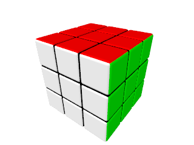
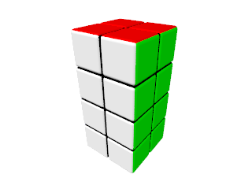
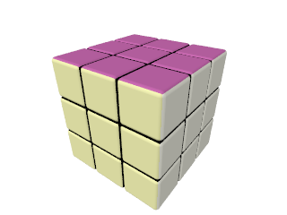
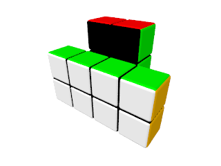
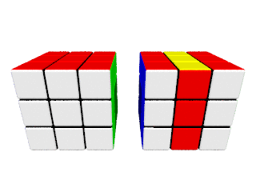

POV-Ray Rubik's Cube
====================

Basics
------

### Cube Dimensions

Each cube consists of a number of pieces, which are kept internally as
a 3D array. The dimensions of a cube are given in a form of a 3D
vector. Each element of this vector corresponds to the cube dimension
along the corresponding axis (in number of pieces).


### [Simple Cube](simple-cube)



A solved classic 3x3x3 cube can be created in just two steps:

1. Create a 3x3x3 cube with the classic color scheme:
   ```
   rubik_cube_create_cube(<3, 3, 3>, rubik_cube_colors_classic)
   ```

2. The macro above returns created cube in a form of a 3D array. Such
   form is not suitable for rendering. The array is converted into an
   object by means of the following macro:
   ```
   rubik_cube_to_object(...)
   ```


### [Cuboid](cuboid)



Cuboids of any dimensions (for example, Rubik's Tower) can be created
by altering dimensions:
```
  rubik_cube_create_cube(<2, 4, 2>, ...)
```


### [Colors Customization](colors-customization)



Cube colors can be customized by passing an array of colors into the
`rubik_cube_create_cube()` macro:
```
rubik_cube_create_cube(
  ...,
  array[6] { Wheat, Maroon, SlateBlue, MidnightBlue, Tan, Goldenrod }
)
```

Colors order is the same as used in built-in `cubic` pattern: right,
top, back, left, bottom and front.


### [Layers Rotation](layers-rotation)

Layers rotations are given in a form of an array. Each element of the
array is a 4D vector, which describes a layer rotation. The first
three elements of this vector are rotational vector. Only one of those
elements can have a non-zero value. The last element is index of the
layer to be rotated. The minimal index is zero. The layers are counted
along the basis axis.


All but the latest rotation in the array must rotate layers on -180,
-90, 0, 90 or 180 degrees, because rotations on other angles
(non-divisible by 90) 'breaks' the cube:
```
rubik_cube_rotate_layers(
  ...,
  array[2] {<-90, 0, 0, 1>, <0, -30, 0, 2>}
)
```

The valid (non the latest) rotations for a non-square cuboid layer are
limited by -180, 0 and 180 degrees, for the same reason. (though real
cuboids can have 'broken' layers)




### [Basic Animation](basic-animation)

Layers rotations can be easily animated:


```
rubik_cube_animate(
  ...
  array[2] {<-90, 0, 0, 1>, <0, -30, 0, 2>},
  ...
)
```


### [Animation Time Frame](animation-time-frame)

The time when an animation should be started and finished can be
easily configured.



```
rubik_cube_animate(
  cube1,
  ...
  0,           // Clock value, the first animation to be started at.
  0.5          // Clock value, the first animation to be finished at.
)
...
rubik_cube_animate(
  cube2,
  ...
  0.5,         // Clock value, the second animation to be started at.
  1            // Clock value, the second animation to be finished at.
)
```


### [Cube Mixing](cube-mixing)


Often it is impractical to mix a cube with a predefined array of
layers rotations. For this reason, random rotations can be generated
by means of a special macro:
```
rubik_cube_generate_random_movements(
  <3, 3, 3>,   // Cube dimensions.
  5,           // Number of random rotations.
  seed(1)      // Seed for randomizer.
)
```

**Attention!** It is important to pass the correct cube dimensions to
the macro, as it takes into account valid rotation angles for
non-square layers.


### [Movements Reflection](movements-reflection)

To return a cube back into its condition after layers rotations, those
rotations can be 'reflected':
```
rubik_cube_reflect_movements(fwd_movements)
```


